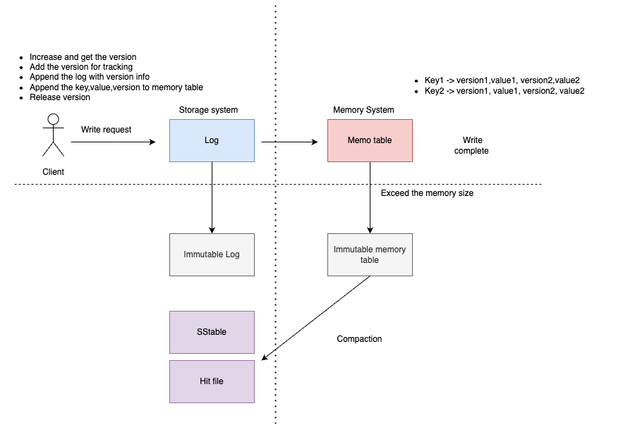

# BytesDB

BytesDB is a database based on LSM tree engine.

It is designed for high volume and easy to extended to develop distributed.

## Status

Implementing single mode and on server side.
The storage format is inspired by [Bitcask](https://riak.com/assets/bitcask-intro.pdf)

## Single mode

### Server

Now, it is initial stage of the project, first step is going to implement the single
database that is K/V style. Then add metadata management to allow user use it in more
rich ways.

#### Write

## Distributed mode
Based on [RAFT](https://raft.github.io/raft.pdf).
TBD.

## Contribute
TBD.

## License

Licensed under the Apache License, Version 2.0 (the "License")